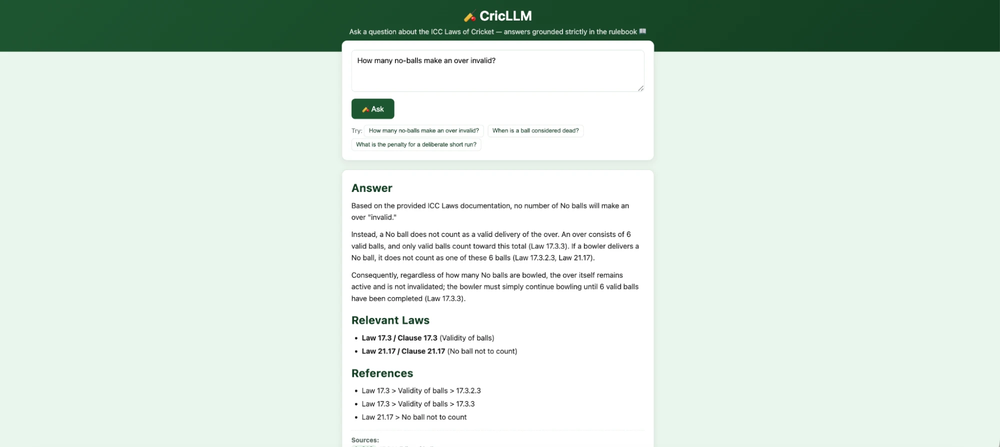

# 🏏 CricLLM

A RAG assistant that answers questions about the **ICC Laws of Cricket** —
grounded strictly in the official rulebook, never in vibes or half-remembered
commentary. Ask it something like *"How many no-balls make an over invalid?"*
or *"What happens if a fielder deliberately deflects the ball with their
helmet?"* and it retrieves the actual relevant Law before answering, citing
exactly which section it came from.



## 🎯 Why this exists

The Laws of Cricket are dense, cross-referencing, and full of exceptions —
Law 21 doesn't make sense without Law 20, penalties depend on clauses buried
three levels deep, and "common knowledge" about cricket is wrong disturbingly
often (there's no rule capping no-balls per over, for instance — a lot of
"obvious" cricket facts aren't actually written down anywhere). Asking an LLM
cold risks a confident, plausible-sounding, wrong answer. This project instead
chunks the rulebook by meaning and structure, embeds it, and forces every
answer to be traceable back to a specific Law.

## 🧠 How it works

```
🥍 ingest (once, or whenever the rulebook changes)
   pdf_md.py (optional)  →  data/icc_rulebook.md
        │
        ▼
   scripts/run_ingestion.py
        │
        ├── load & sanity-check the Markdown
        ├── split on Law / Section headers (# .. ####)
        ├── separate tables/lists/clauses from prose (never split mid-clause)
        ├── pack into ~400–700 token chunks
        ├── embed each chunk with Gemini
        └── store in a hosted Pinecone index

🏏 ask (every question)
   scripts/ask.py "your question"
        │
        ├── embed the question
        ├── retrieve the most relevant Law excerpts
        └── ask Gemini to answer ONLY from those excerpts, with citations

🖥️ or just use the browser UI — see "Web UI" below
```

## 📖 Chunking strategy (hybrid semantic chunking)

1. **Header split** — the rulebook is split on `#`..`####`, so every chunk
   carries its full Law/Section lineage as metadata (e.g.
   `Law 21 > No ball > 21.17 No ball not to count`).
2. **Atomic segmentation** — tables (penalty tables, run tables), lists, and
   fenced blocks are treated as **atomic** and never split mid-row/mid-item.
   Everything else is prose, eligible for further splitting.
3. **Semantic prose splitting** — an oversized prose passage is re-split
   using LangChain's embedding-driven `SemanticChunker` (meaning-based
   breakpoints, not a fixed character count), falling back to a token-aware
   recursive splitter if disabled.
4. **Token-budget packing** — segments are packed into ~400–700 token
   chunks. Atomic segments are **never** split — unless one alone would
   exceed Gemini's actual embedding input limit (~2048 tokens), in which
   case it gets force-split as a genuine last resort, tagged
   `forced_split: true` so you can tell it apart from a normal chunk.

Each chunk carries: `source`, `header_path`, `h1`–`h4`, `block_types`,
`chunk_index`, `token_count`, and `chunk_hash` (used as the Pinecone vector ID).

## ⚡ Resilience features

| Feature | How |
|---|---|
| Batching | Embedding calls batched (`CRICLLM_EMBED_BATCH_SIZE`, default 32) |
| Retry + backoff | `tenacity` exponential backoff per batch |
| Caching | SQLite cache keyed by `sha256(text) + model + task_type` — never re-embeds unchanged text, and never confuses a document embedding for a query embedding |
| Incremental indexing | Per-file SHA256 skips unchanged files entirely on re-run |
| Duplicate detection | Chunk content hash is the Pinecone vector ID — duplicates upsert, don't duplicate |
| Resume after interruption | An `ingested_chunks` ledger + per-batch caching mean a killed run only leaves the genuine remainder to redo — no restarting from zero |
| Corrupted Markdown / bad UTF-8 / empty files | Handled without aborting the whole run |
| Failed batches | Written to `logs/dead_letter/` as JSON instead of losing progress |
| Logging + progress bars | Rotating file log (`logs/cricllm.log`) + `tqdm` |

## 🚀 Setup

```bash
cd cricllm
python3 -m venv .venv
source .venv/bin/activate
pip install -r requirements.txt
cp .env.example .env
# edit .env and set GOOGLE_API_KEY and PINECONE_API_KEY
# (free Pinecone account: https://app.pinecone.io, no credit card needed)
```

Place the rulebook at `data/icc_rulebook.md` (or point `--input` at any
Markdown file/directory). If you're starting from the official PDF,
`pdf_md.py` converts it to Markdown first.

## 🏏 Usage

```bash
# Ingest the rulebook (once, or whenever it changes)
python scripts/run_ingestion.py --input data/icc_rulebook.md

# Force a full re-index regardless of the file-hash cache
python scripts/run_ingestion.py --input data/icc_rulebook.md --force

# Ask a question from the command line
python scripts/ask.py "How many no-balls make an over invalid?"
python scripts/ask.py "..." --top-k 8

# Or, if installed as a package (`pip install -e .`):
cricllm-ingest --input data/icc_rulebook.md
```

If the process is killed mid-run, just re-run the same command —
already-ingested chunks are detected and skipped.

## 🖥️ Web UI

A basic browser front-end is included so you don't have to use the CLI:

```bash
pip install flask
python app.py
```

Then open **http://localhost:5000** — type a question, hit ask, and watch the
answer stream in as it's generated, with cited Laws and retrieval sources
underneath. `POST /api/ask` streams Server-Sent Events instead of waiting
for the whole answer before responding — same retrieval + generation logic
as `scripts/ask.py` (both go through `cricllm.qa.QAEngine`), plus one static
HTML page (`templates/index.html`) with vanilla JS — no build step, no
framework. Streaming also helps if you deploy this behind gunicorn: a
worker's timeout clock resets on every chunk sent, so a slow generation
doesn't just sit silent until the whole request gets killed.

## ⚙️ Configuration

All settings are environment variables (see `.env.example`), prefixed
`CRICLLM_` except `GOOGLE_API_KEY`:

| Variable | Default | Meaning |
|---|---|---|
| `GOOGLE_API_KEY` | — | Gemini API key (required) |
| `PINECONE_API_KEY` | — | Pinecone API key (required) |
| `CRICLLM_EMBEDDING_MODEL` | `models/gemini-embedding-001` | Hosted embedding model |
| `CRICLLM_EMBEDDING_DIMENSION` | 3072 | Must match the embedding model's real output size — also sets the Pinecone index's dimension |
| `CRICLLM_MIN_CHUNK_TOKENS` | 400 | Target minimum chunk size |
| `CRICLLM_MAX_CHUNK_TOKENS` | 700 | Target maximum chunk size |
| `CRICLLM_HARD_MAX_CHUNK_TOKENS` | 1400 | Ceiling before an oversized atomic block is logged and kept whole anyway |
| `CRICLLM_MAX_EMBEDDING_INPUT_TOKENS` | 2048 | Gemini's real `embedContent` input ceiling — anything bigger gets force-split |
| `CRICLLM_EMBED_BATCH_SIZE` | 32 | Texts per embedding API call |
| `CRICLLM_MAX_RETRIES` | 6 | Max attempts per embedding batch |
| `CRICLLM_RETRY_MIN_SECONDS` / `CRICLLM_RETRY_MAX_SECONDS` | 1 / 60 | Exponential backoff bounds |
| `CRICLLM_USE_SEMANTIC_CHUNKING` | true | Use embedding-based semantic splitting for oversized prose |
| `CRICLLM_CACHE_DB` | `.cache/cricllm_cache.sqlite3` | SQLite cache/state database |
| `CRICLLM_LOG_DIR` | `logs` | Log output directory |
| `CRICLLM_DEAD_LETTER_DIR` | `logs/dead_letter` | Failed-batch records |
| `CRICLLM_PINECONE_INDEX_NAME` | `cricllm-icc-laws` | Pinecone index name (auto-created if missing) |
| `CRICLLM_GENERATION_MODEL` | `gemini-2.5-flash` | Chat model used at query time |
| `CRICLLM_RETRIEVAL_TOP_K` | 5 | Default number of chunks retrieved per question |

## 🧪 Testing

```bash
pip install -r requirements.txt
pytest -q
```

Tests cover hashing, header-hierarchy preservation, atomic segment detection,
end-to-end chunk packing, per-batch embedding cache resilience, and the
Pinecone vector store wrapper (via a fake client double) — all without
requiring a live Gemini API key or a real Pinecone account.

## 🛠️ Design notes

- **Token counting is a proxy.** No public offline tokenizer exists for
  Gemini, so `tiktoken`'s `cl100k_base` encoding approximates chunk sizing.
  The 400–700 token target is "roughly," by design.
- **Vector storage is hosted on Pinecone**, not a local database. We
  originally ran this on local `chromadb`, but its Python client
  reproducibly hung the moment it was called from inside a live gunicorn
  worker on Render — confirmed through extensive isolation testing to be
  neither our code, the data, the API key, nor memory pressure, but
  something specific to chromadb's own (Rust-backed) client in that process
  context. Pinecone's plain REST/HTTP client sidesteps it entirely, and as
  a bonus, the rulebook's actual text no longer needs to live on disk (or
  in git) at all — see `RUNBOOK.md` for the full incident writeup.
- **Cosine similarity**, not Euclidean distance — Gemini embeddings aren't
  guaranteed unit-length, so cosine is the correct metric. Pinecone returns
  a similarity score (higher = closer); `VectorStore.query()` converts it
  to `1 - score` so the rest of the app can treat it like a distance
  (lower = closer), independent of which vector store is behind it.
- **Ingestion vs. query embeddings.** `task_type=RETRIEVAL_DOCUMENT` for
  ingestion, `RETRIEVAL_QUERY` for asking — Gemini tunes these differently,
  and the cache is keyed by task type so the two never collide.
- **Semantic chunking costs API calls**, only runs on prose that's already
  oversized, and can be disabled via `CRICLLM_USE_SEMANTIC_CHUNKING=false`.
- **"Never split atomic blocks" has one real exception** — Gemini's input
  ceiling. See `forced_split` in chunk metadata.

See [RUNBOOK.md](RUNBOOK.md) for a per-file reference of every module and an
incident playbook of real issues hit while building this.
